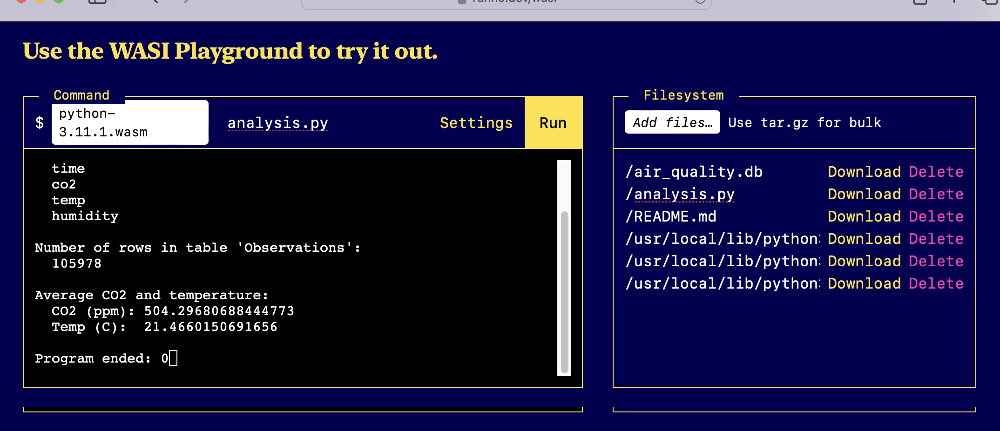

Python wasm example
===================

This repository contains a very basic example of a Python data analysis. It includes Python 3.11.1 compiled to WebAssembly, and should run on any wasm runtime that supports WASI.


## Prerequisites

Running this requires a wasm runtime that supports WASI. There are at least 10 such runtimes listed [here](https://github.com/appcypher/awesome-wasm-runtimes).

If you are on a Mac with Homebrew, you can install [wasmtime](https://wasmtime.dev/): with:

```sh
brew install wasmtime
```

Instructions for installing wasmtime on all platforms is [here](https://docs.wasmtime.dev/cli-install.html).


## Running the analysis

To run the analysis, you simply need to tell your wasm runtime to run the Python wasm binary, with the current directory mounted as root, and with the `analysis.py` file as an argument to Python.

For example, with wasmtime:

```sh
wasmtime run --mapdir /::$PWD bin/python-3.11.1.wasm -- analysis.py
```

It will produce this output:

```
Tables in air_quality.db:
  [('Observations',)]

Columns in table 'Observations':
  time
  co2
  temp
  humidity

Number of rows in table 'Observations':
  105978

Average CO2 and temperature:
  CO2 (ppm): 504.29680688444773
  Temp (C):  21.4660150691656
```


You can also run it in the browser, using the [Runno WASI Playground](https://runno.dev/wasi) page:



To run it in the Runno WASI Playground, you need to:

- Upload `bin/python-3.11.1.wasm` as the WASM binary
- Set the argument to `analysis.py`
- Upload the other files from this repository. The files will be uploaded to the root directory of the remote VFS, so after uploading, you will need to edit the paths for the uploaded files to match the paths in this repository. This can be done by just clicking the filename in the web page and typing the new path.


## Notes

The build of Python is from:
* https://github.com/vmware-labs/webassembly-language-runtimes/releases?q=python
* https://wasmlabs.dev/articles/python-wasm32-wasi/
